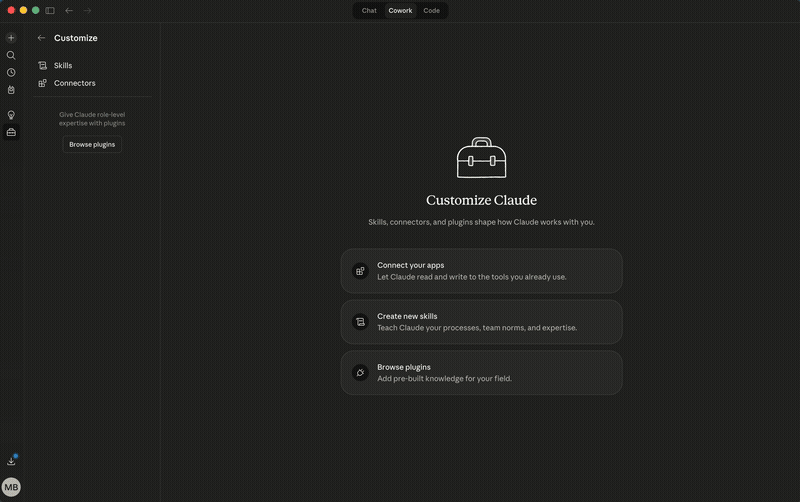

# Open Tooling CRM Plugin

**Install the plugin. Ask Claude to use the CRM. Everything just works.**

Gives Claude the knowledge layer to use [Open Tooling CRM](https://github.com/Attri-Inc/open-tooling/tree/main/crm) — an open-source, agent-first CRM with evidence-based memory, 27 MCP tools, and zero vendor lock-in.

---

## See It in Action

<!-- TODO: Replace with GIF showing marketplace install → plugin install → /crm-setup → first query -->
<!--  -->

> **GIF placeholder:** Marketplace install → plugin install → hands-off `/crm-setup` → first CRM query. Zero manual configuration.

---

## Getting Started

1. **Install this plugin** from the [Open Tooling marketplace](https://github.com/Attri-Inc/open-tooling-plugins)
2. **Clone and install** in your local terminal:
   ```bash
   git clone https://github.com/Attri-Inc/open-tooling.git ~/open-tooling
   cd ~/open-tooling/crm
   npm install && cp .env.example .env
   npm run seed
   ```
3. **Add the MCP server to Claude Desktop** — open **Settings → Developer → Edit Config** and add:
   ```json
   {
     "mcpServers": {
       "open-tooling-crm": {
         "command": "npx",
         "args": ["tsx", "/absolute/path/to/open-tooling/crm/src/mcp.ts"],
         "env": {
           "CRM_DB_PATH": "/absolute/path/to/open-tooling/crm/data/crm.db"
         }
       }
     }
   }
   ```
   Replace the paths with your actual install location (e.g., `/Users/yourname/open-tooling/crm`).
4. **Restart Claude Desktop** and start a new conversation — all commands and skills are live

Or just ask Claude to "use Open Tooling CRM" — it detects that setup is needed and walks you through it.

---

## What You Get

### Commands (user-invoked)

| Command | What it does |
|---------|--------------|
| `/crm-setup` | **Start here** — clones repo, installs deps, seeds data, wires MCP server |
| `/crm-ingest` | Ingest an email, transcript, or document into the CRM evidence chain |
| `/crm-brief` | Get a full briefing on a contact, company, or deal — backed by evidence |
| `/crm-status` | Quick pipeline overview, recent activity, and open conflicts |

### Skills (auto-triggered)

These activate automatically based on what you're doing — no commands needed:

| Skill | Activates when... |
|-------|-------------------|
| **CRM Onboarding** | You ask to get started or use the CRM for the first time |
| **Evidence Ingestion** | You share an email, transcript, or document to ingest |
| **Entity Management** | You want to create, search, or manage contacts, companies, deals |
| **Memory Layer** | You ask "what do we know about X?" or want to verify a claim |

### How Skills Work

When you paste an email and say "add this to the CRM," the evidence ingestion skill kicks in automatically. Claude:

1. Ingests the raw content as an immutable artifact
2. Extracts typed observations (facts, sentiments, intents, metrics)
3. Links observations to entities (creating contacts/companies if needed)
4. Checks for conflicts against existing knowledge
5. Updates briefs for affected entities

Every claim traces back to its source. Every claim has receipts. That's the evidence chain — and it's what makes Open Tooling CRM fundamentally different from traditional CRMs.

---

## Why This Plugin?

Open Tooling CRM has 27 MCP tools. The plugin teaches Claude *when* and *how* to use them — the right patterns, the right order, the domain reasoning that makes the difference between "tool that can query a database" and "agent that manages your CRM."

Without the plugin, Claude can call the tools but doesn't know the evidence-chain workflow, progressive retrieval patterns, or conflict resolution strategies. With the plugin, Claude operates your CRM like it was trained on it.

---

## Manual Setup

If you prefer to set things up yourself:

1. `git clone https://github.com/Attri-Inc/open-tooling.git ~/open-tooling`
2. `cd ~/open-tooling/crm && npm install && cp .env.example .env`
3. `npm run seed` (optional — populates sample data)
4. Add the MCP server to `claude_desktop_config.json` (see Getting Started above for the JSON config)
5. Restart Claude Desktop

---

## Connectors (Optional)

| Category | Examples | What it powers |
|----------|---------|----------------|
| Email | Gmail, Outlook | Auto-ingest emails as artifacts |
| Calendar | Google Calendar, Outlook | Log interactions, prep for meetings |
| Chat | Slack, Teams | Capture conversation context |
| Documents | Google Drive, Notion | Ingest docs and extract structured data |
| Enrichment | Clay, ZoomInfo, Apollo | Auto-populate contact and company data |

None required. The plugin works fully with just the CRM's MCP server.

---

## Part of Open Tooling

This is the first plugin in the [Open Tooling](https://github.com/Attri-Inc/open-tooling) family. More modules and plugins coming — HR, Finance, Project Management, Procurement — each with their own dedicated plugin that teaches Claude domain-specific reasoning.

Plugin marketplace: [Attri-Inc/open-tooling-plugins](https://github.com/Attri-Inc/open-tooling-plugins)
Core tools: [Attri-Inc/open-tooling](https://github.com/Attri-Inc/open-tooling)
